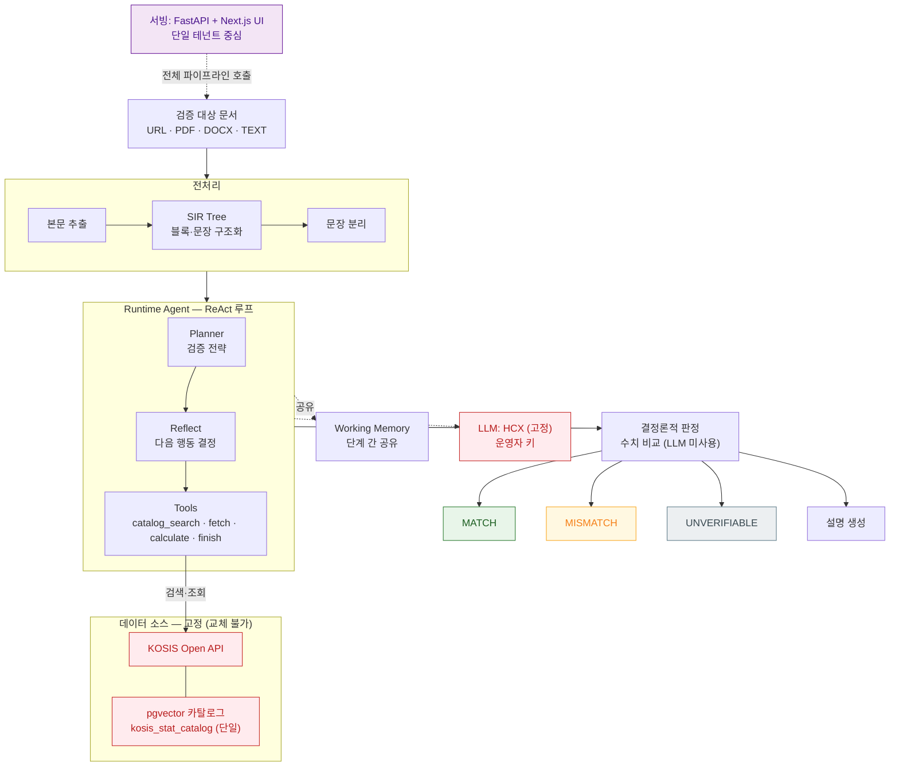
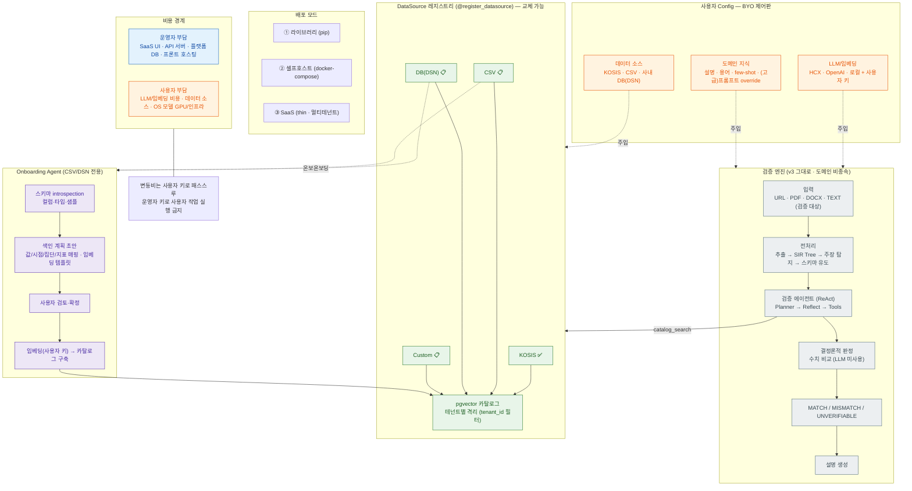

# StructVerify — 도메인 독립형 사실검증 엔진 (v4 계획안)

> **"정답 데이터만 정의하면, 어떤 문서든 검증한다."**
>
> 뉴스·KOSIS는 *실험 도메인* 이었을 뿐, 엔진 자체는 사용자가 가져온 데이터(BYO Data)와
> 사용자가 가져온 LLM(BYO Key)으로 동작하는 **도메인 독립 검증 엔진** 입니다.
>
> 이 문서는 고도화 방향(라이브러리화 + SaaS + 커스텀 데이터 소스)을 정리한 **계획안(V1 draft)** 입니다.
> 현재 운영 중인 구조(v3)는 **backend 저장소의 README** 를 참고하세요. 이 문서의 항목 중 ✅ 외에는 아직 구현 전이며,
> **코드 변경 없이 방향만 정리** 한 상태입니다.
>
> 상태 표기: ✅ 구현됨 · 🚧 진행/부분구현 · 📋 계획

---

## 목차

1. [배경 — 왜 도메인 독립인가](#1-배경--왜-도메인-독립인가)
2. [v3 → v4: 무엇이 바뀌나](#2-v3--v4-무엇이-바뀌나)
3. [한눈에 보기](#3-한눈에-보기)
4. [세 가지 사용 방식 & 비용 부담](#4-세-가지-사용-방식--비용-부담)
5. [정답 데이터와 데이터 소스](#5-정답-데이터와-데이터-소스)
6. [사용자 Config — BYO 제어판](#6-사용자-config--byo-제어판)
7. [워크드 예시 — 회사 매출 데이터 검증](#7-워크드-예시--회사-매출-데이터-검증)
8. [멀티테넌트 격리 & 보안](#8-멀티테넌트-격리--보안)
9. [아키텍처](#9-아키텍처)
10. [빠른 시작](#10-빠른-시작)
11. [SaaS API (목표)](#11-saas-api-목표)
12. [로드맵](#12-로드맵)
13. [FAQ](#13-faq)
14. [용어집](#14-용어집)

---

## 1. 배경 — 왜 도메인 독립인가

요즘 문서에는 숫자가 가득합니다. 뉴스 기사의 "전년 대비 8.7% 증가", 회사 보고서의 "3분기 매출 120억", 리포트의 "OECD 평균보다 낮은 수준" 같은 표현이 대표적입니다. 그런데 이 숫자가 *정말 맞는지* 확인하려면, 원본 데이터를 찾아 시점·집단을 맞춰 대조해야 합니다. 사람이 일일이 하기엔 품이 너무 많이 들고, 자동화하려 해도 대개 *특정 도메인·특정 데이터셋* 에 묶여 새 주제가 나오면 다시 만들어야 했습니다.

StructVerify v3는 이 문제를 "뉴스 기사 ↔ KOSIS(국가통계포털)" 조합으로 풀었습니다. 그런데 만들면서 분명해진 사실이 하나 있습니다. **검증 로직 어디에도 "뉴스" 나 "KOSIS" 가 본질적으로 필요하지 않다** 는 것입니다. 엔진이 하는 일은 결국 "문서에서 수치 주장을 뽑아 *어떤 정답 데이터* 와 대조한다" 이고, 여기서 *정답 데이터* 만 갈아 끼우면 전혀 다른 분야로 확장됩니다.

```
NOW                      NEXT (확장 가능 도메인)
뉴스 · KOSIS        →     사내 매출/비용 DB · 의료 통계 · 환경 데이터 · 금융 자료 · …
```

그래서 v4의 목표는 **엔진을 그대로 두고, 정답 데이터·LLM·도메인 지식을 전부 "사용자가 주입" 하게 만드는 것** 입니다. 이렇게 하면 같은 엔진이 *오픈소스 라이브러리* 로도, *기업 사내 검증 도구* 로도, *결제형 SaaS* 로도 쓰일 수 있습니다.

---

## 2. v3 → v4: 무엇이 바뀌나

엔진의 검증 로직(전처리·탐지·에이전트·판정)은 그대로 두고, **데이터 소스·LLM·설정 레이어** 만 일반화합니다.

| 영역 | v3 (현재) | v4 (계획) |
|---|---|---|
| 정답 데이터 | KOSIS 고정 | KOSIS · **CSV · 사내 DB(DSN)** 주입 |
| LLM | HCX 중심 | **HCX · OpenAI · 로컬** 주입 (BYO Key) |
| 도메인 지식 | 코드/프롬프트에 내장 | **사용자 config 의 `domain` 섹션** |
| 데이터 색인 | KOSIS 카탈로그 사전 구축 | **Onboarding Agent 가 사용자 데이터 색인 계획 자동 수립** |
| 배포 | 단일 서비스 | **라이브러리 · 셀프호스트 · SaaS** 3종 |
| 비용 | 운영자 부담 | **변동비는 사용자 키로 패스스루(BYO)** |
| 격리 | 단일 | **멀티테넌트(tenant_id) 격리** (SaaS) |

엔진 내부(SIR Tree · claim detection · ReAct 에이전트 · 결정론 판정)는 v3 그대로 재사용합니다. 즉 이번 작업은 *재작성* 이 아니라 *이미 깔린 추상화(데이터 소스 레지스트리, LLM 주입, 멀티테넌트 골격)의 활성화* 에 가깝습니다.

---

## 3. 한눈에 보기

비정형 문서(URL · PDF · DOCX · TEXT)에서 **수치 기반 주장** 을 자동 추출하고, *사용자가 정의한 정답 데이터* 와 객관 비교해 사실 여부(MATCH / MISMATCH / UNVERIFIABLE)를 판정합니다.

핵심은 **세 가지가 전부 주입식(injectable)** 이라는 점입니다.

| 주입 대상 | 무엇을 | 누가 정함 | 상태 |
|---|---|---|---|
| **정답 데이터** | KOSIS · CSV · 사내 DB(DSN) | 사용자 config | KOSIS ✅ / 나머지 📋 |
| **LLM / 임베딩** | HCX · OpenAI · 로컬 모델 + 키 | 사용자 config (BYO Key) | HCX ✅ / 추상화 🚧 |
| **도메인 지식** | 도메인 설명·용어·매핑·few-shot | 사용자 config (일부 프롬프트) | 📋 |

엔진 코드에는 "뉴스" 나 "KOSIS" 가 하드코딩되어 있지 않으므로, config만 바꾸면 *기업 내부 문서 검증* 같은 전혀 다른 용도로 쓸 수 있습니다.

---

## 4. 세 가지 사용 방식 & 비용 부담

같은 엔진을 세 가지 형태로 제공합니다. 핵심 차이는 **변동비(모델·데이터)를 누가 내느냐** 입니다.

| 방식 | 형태 | 적합한 사용자 | 운영자 부담 | 사용자 부담 |
|---|---|---|---|---|
| **① 라이브러리** 📋 | `pip install structverify` | 직접 코드에 통합하려는 개발자 | — | 전부 (자기 환경에서 실행) |
| **② 셀프호스트** 🚧 | docker-compose 전체 스택 | 데이터를 외부에 안 보내려는 기업 | — | 전부 (자기 서버·키·데이터) |
| **③ SaaS (thin)** 🚧 | 우리가 호스팅하는 UI/API | 빠르게 써보려는 일반 사용자 | **플랫폼 인프라만** | **변동비 전부** |

### 4.1 비용 패스스루(BYO) 원칙 — SaaS 모드

> 운영자는 *로직과 UI* 만 제공한다. 검증할 때 드는 **변동비는 사용자 키로 패스스루** 된다.

| 비용 항목 | 부담 주체 |
|---|---|
| SaaS UI · 프론트 호스팅 · API 서버 · 플랫폼 DB | **운영자** |
| LLM API 호출 비용 (검증 시 모델 호출) | **사용자** (config의 자기 키로 호출) |
| 임베딩(카탈로그 구축) 비용 | **사용자** (자기 키) |
| 정답 데이터 소스 비용 (KOSIS 키 / 사내 DB 운영) | **사용자** |
| OS(오픈소스) 모델 셀프호스팅 시 GPU·인프라 | **사용자** |

이 구조의 의도는 단순합니다. **운영자에게는 변동비가 거의 없으니** 사용자가 검증을 많이 돌려도 운영자 비용이 폭증하지 않고, 사용자는 *자기가 쓴 만큼만* 자기 키로 청구받습니다. 운영자는 *플랫폼 이용료* 만 과금하면 됩니다.

### 4.2 구현 시 지켜야 할 규칙

- ⚠️ **운영자 키로 사용자 작업을 절대 실행하지 않는다.** 한 번이라도 운영자 기본 키로 폴백되면 그 비용을 운영자가 부담하게 됩니다. 사용자 키가 없으면 *작업을 거부* 해야 합니다.
- 사용자 키는 **암호화 저장 + 테넌트 격리**, 또는 **요청마다만 받고 저장하지 않음** 옵션 중 선택.
- 사용량(토큰·문서 수)을 **미터링** 해 과금·쿼터에 사용.

---

## 5. 정답 데이터와 데이터 소스

### 5.1 개념

- **정답 데이터(카탈로그)** — 검증의 *기준* 이 되는 사용자 데이터. 임베딩되어 pgvector 카탈로그로 색인된다. (KOSIS의 `kosis_stat_catalog` 를 일반화한 것)
- **검증 대상 문서** — 사용자가 제출하는 URL/PDF/DOCX/TEXT. 여기서 추출한 주장을 *정답 데이터* 와 대조한다.

즉 "정답 데이터" 와 "검증 대상" 은 별개입니다. 정답 데이터는 *한 번 색인해 두고 재사용* 하고, 검증 대상 문서는 *매번 새로* 들어옵니다.

### 5.2 지원 소스

| 소스 | 상태 | 설명 |
|---|---|---|
| **KOSIS** | ✅ | 국가통계포털 (기본 제공 데이터 소스) |
| **CSV 업로드** | 📋 | 표 형태 파일을 올리면 카탈로그로 색인 |
| **DB 연결(DSN)** | 📋 | 사내 DB(PostgreSQL/MySQL 등)에 연결, 스키마를 읽어 색인 |

새 소스는 `BaseDataSource` 상속 + `@register_datasource("name")` 로 추가합니다 (✅ 레지스트리 패턴 존재, 커넥터 활성화는 📋).

### 5.3 Onboarding Agent — DSN/CSV 자동 색인 계획 📋

DSN/CSV는 구조를 모르는 채 들어오므로, **어시스턴트 에이전트가 색인 계획을 초안으로 짜고 사용자가 확정** 하는 방식으로 온보딩합니다. 완전 수동(사용자가 모든 매핑을 손으로)도 아니고, 완전 자동(에이전트가 멋대로 결정)도 아닌 **"에이전트 초안 → 사용자 확정"** 패턴입니다.

```
[사용자] CSV 업로드  또는  DB(DSN) 연결
        │
        ▼
① 스키마 introspection
   - 테이블·컬럼·타입·코멘트 읽기
   - 각 컬럼 샘플 row 몇 개 미리보기 (값의 형태 파악)
        │
        ▼
② Onboarding Agent 초안 작성
   - 컬럼 역할 매핑 제안: 어떤 컬럼이 값(value) / 시점(time) / 집단(population) / 지표(indicator) 인가
   - 임베딩 텍스트 조합 방식 제안 (KOSIS의 "category_path > stat_name" 같은 템플릿)
   - 도메인 설명 · 용어 힌트 초안 (컬럼명·코멘트에서 추론)
        │
        ▼
③ 사용자가 config 에서 검토 · 수정 · 확정       ← 도메인 지식은 사용자가 손봄
        │
        ▼
④ 확정 매핑으로 임베딩 → 카탈로그 구축
   (임베딩 호출은 사용자 키로 = 사용자 비용)
        │
        ▼
⑤ 이후 검증은 이 카탈로그를 catalog_search / fetch 로 사용
   (KOSIS 자리에 그대로 대체)
```

**Onboarding Agent가 추론하는 것** (예: `sales_monthly(metric_name, period, region, amount, currency)` 테이블이라면):

| 추론 항목 | 에이전트 제안 | 근거 |
|---|---|---|
| value 컬럼 | `amount` | 숫자형 + 컬럼명 |
| time 컬럼 | `period` | 날짜/기간 형태 샘플 |
| population 컬럼 | `region` | 분류 축으로 보이는 범주형 |
| indicator 컬럼 | `metric_name` | "매출/영업이익" 같은 지표명 |
| 임베딩 템플릿 | `"{metric_name} ({region})"` | 검색 매칭에 쓸 텍스트 |

사용자는 이 초안을 보고 *틀린 매핑만 고치면* 됩니다. 이게 "어시스턴트 에이전트 느낌"의 온보딩입니다.

### 5.4 Custom DataSource 직접 추가 (고급) 📋

라이브러리/셀프호스트 사용자는 위 커넥터 대신 *직접* 데이터 소스를 구현할 수도 있습니다. 패턴은 v3에 이미 있는 레지스트리를 그대로 씁니다.

```python
from structverify.retrieval.base import BaseDataSource, register_datasource

@register_datasource("my_source")
class MyDataSource(BaseDataSource):
    async def search_catalog(self, query) -> list[StatRecord]:
        """주장 → 후보 표/행 목록 (의미 검색 등)"""
        ...

    async def fetch_evidence(self, candidate_id, params) -> Evidence:
        """후보에서 실제 값 가져오기"""
        ...
```

```yaml
# config.yaml
data_sources:
  enabled: ["my_source"]
  my_source:
    # 소스별 설정
```

엔진의 나머지(에이전트·판정)는 *Tool을 통해서만* 데이터 소스를 호출하므로, 소스를 바꿔도 엔진 코드는 손대지 않습니다.

---

## 6. 사용자 Config — BYO 제어판

자유도의 핵심은 config 파일입니다. *도메인을 알아야만 채울 수 있는 것* 만 사용자에게 맡기고, 엔진 내부 프롬프트는 기본값으로 잠급니다.

### 6.1 전체 예시

```yaml
# 사용자 config.yaml

llm:                              # ← 사용자 (BYO Key)
  provider: openai                # hcx | openai | local
  model: gpt-4o-mini
  api_key_env: USER_LLM_KEY       # 키 값이 아니라 "환경변수 이름" 을 적음
embedding:
  provider: openai
  model: text-embedding-3-small
  api_key_env: USER_LLM_KEY

data_sources:
  enabled: ["company_db"]
  company_db:
    type: db                      # csv | db
    dsn_env: USER_DB_DSN          # DSN은 config가 아니라 env로 (보안)
    tables: ["sales_monthly"]
    column_mapping:               # ★ 에이전트 초안 → 사용자 확정 (정확도 직결)
      indicator: metric_name
      time: period
      population: region
      value: amount
      unit: currency
    embed_template: "{metric_name} ({region})"

domain:                           # ★ 사용자가 작성하는 프롬프트 영역
  description: "분기별 매출·비용 데이터. 지표는 매출/영업이익/판관비 등."
  indicator_hints: "매출, 영업이익, 판관비, 인건비, 광고선전비"
  checkworthy_examples:           # (선택) 검증 대상 정의 few-shot
    positive: ["2024년 3분기 매출은 120억이다"]
    negative: ["매출이 늘 것으로 전망된다"]

verification:
  tolerance_percent: 1.0          # 일치 판정 허용 오차

advanced:                         # ★ 고급 사용자 전용 (기본 비활성)
  prompt_overrides:
    enabled: false                # true 로 켜야 아래가 적용됨
    planner: null                 # 커스텀 planner 프롬프트 (파일 경로/문자열)
    reflect: null
    verifier: null
```

### 6.2 필드별 설명

| 섹션 | 필드 | 설명 |
|---|---|---|
| `llm` | `provider` / `model` / `api_key_env` | 검증에 쓸 LLM. 키는 *값* 이 아니라 *환경변수 이름* 으로 적어 config 파일에 비밀이 남지 않게 함 |
| `embedding` | 〃 | 카탈로그 색인·검색용 임베딩 모델 |
| `data_sources.<name>.type` | `csv` / `db` | 소스 종류 |
| 〃 `dsn_env` | | DB 접속 문자열의 *환경변수 이름* (DSN 자체는 env로만) |
| 〃 `column_mapping` | | 컬럼 → 역할(value/time/population/indicator/unit) 매핑. **정확도에 가장 직접적** |
| 〃 `embed_template` | | 행을 임베딩할 때 만들 텍스트 템플릿 |
| `domain.description` | | 이 데이터가 무엇인지 한두 문장. 도메인 분류·스키마 유도에 힌트로 주입 |
| `domain.indicator_hints` | | 이 도메인의 주요 지표 용어 (검색·매칭 보조) |
| `domain.checkworthy_examples` | | "이런 문장은 검증 대상/아님" few-shot (선택) |
| `verification.tolerance_percent` | | 수치 일치로 볼 허용 오차 |
| `advanced.prompt_overrides` | | 고급: 엔진 내부 프롬프트 교체 (기본 잠금) |

### 6.3 누가 무엇을 작성하나

| config 항목 | 작성 주체 | 비고 |
|---|---|---|
| `llm` / `embedding` provider + key | **사용자** | BYO 키 (비용 패스스루) |
| `data_sources.*.dsn_env` | **사용자** | DSN은 env로만 (보안) |
| `column_mapping` / `embed_template` | **에이전트 초안 → 사용자 확정** | 정확도 직결 |
| `domain.description` / `indicator_hints` | **사용자 작성** | 도메인 지식 |
| `checkworthy_examples` | 사용자 (선택) | few-shot |
| `advanced.prompt_overrides` | **고급 사용자만** (기본 잠금) | planner/reflect/verifier 등 교체 |
| 그 외 엔진 프롬프트 전부 | **시스템 기본 제공** | 일반 사용자는 안 건드림 |

> 설계 원칙: **도메인/매핑/few-shot은 사용자, 엔진 프롬프트는 잠금.** 단 고급 사용자는 `advanced.prompt_overrides.enabled: true` 로 엔진 프롬프트까지 교체할 수 있다.

### 6.4 고급 — 엔진 프롬프트 override

대부분의 사용자는 `domain` 섹션만 채우면 됩니다. 하지만 검증 로직 자체를 자기 도메인에 맞게 깊이 튜닝하려는 고급 사용자를 위해, planner·reflect·verifier 같은 *엔진 프롬프트* 를 교체하는 경로를 둡니다. 기본은 잠겨 있어(`enabled: false`) 일반 사용자가 실수로 엔진을 망가뜨릴 일은 없습니다.

---

## 7. 워크드 예시 — 회사 매출 데이터 검증

한 회사가 *자기 분기 보고서의 숫자가 사내 DB와 일치하는지* 검증하려는 시나리오입니다.

**상황**
- 정답 데이터: 사내 PostgreSQL의 `sales_monthly(metric_name, period, region, amount, currency)`
- 검증 대상: `2024_Q3_실적보고.pdf` ("2024년 3분기 전사 매출은 120억으로 전년 동기 대비 8% 증가했다.")

**흐름**

```
1) 온보딩
   - config의 company_db(DSN) 연결
   - Onboarding Agent: amount=value, period=time, region=population, metric_name=indicator 제안
   - 사용자 확인 → 임베딩 → catalog_company_db 구축 (사용자 OpenAI 키로 임베딩)

2) 문서 검증
   - 2024_Q3_실적보고.pdf 제출
   - 추출 → 주장 탐지 → 스키마 유도:
       { indicator: "매출", time: "2024-Q3", population: "전사", value: 12,000,000,000, unit: "원" }
       + 파생: 8% 증가 (prev: 2023-Q3)
   - 에이전트:
       catalog_search("매출 전사") → company_db 카탈로그에서 후보 행
       fetch_evidence → amount 값 조회
       calculate → 전년 동기 대비 증가율 계산
   - 결정론 판정: 사내 DB 값과 비교 → MATCH / MISMATCH

3) 결과
   - "120억" ↔ 사내 DB 값 대조 + "8% 증가" ↔ 계산값 대조
   - 근거(어느 행에서 왔는지)와 함께 표시
```

여기서 **엔진 코드는 KOSIS 때와 한 줄도 다르지 않습니다.** 바뀐 것은 *카탈로그가 KOSIS가 아니라 사내 DB* 라는 점뿐이고, 그건 config로 주입됩니다. 비용도 임베딩·LLM 모두 *사용자 키* 로 나갔으니 운영자 부담이 없습니다.

---

## 8. 멀티테넌트 격리 & 보안

### 8.1 카탈로그 격리 (SaaS 모드) 📋

SaaS에서는 여러 고객사가 각자 정답 데이터를 올리므로, **A 고객사의 검색이 B 고객사 데이터를 뒤지지 않도록** 격리해야 합니다(데이터 누수 방지).

| 방식 | 설명 | 채택 | 비유 |
|---|---|---|---|
| **tenant_id 컬럼 + 필터** | 한 카탈로그 테이블에 `tenant_id` 를 두고, 검색 시 항상 자기 것만 필터 | **기본 (추천)** | 큰 창고에 이름표 |
| 테넌트별 테이블 분리 | `catalog_<tenant>` 로 분리 | 강한 격리 필요 시 | 고객마다 사물함 |
| 테넌트별 DB 분리 | DB 자체를 분리 | 최강·고비용 | 고객마다 건물 |

- 라이브러리·셀프호스트 모드는 단일 사용자이므로 격리가 필요 없습니다.
- 멀티테넌트 골격(tenant/user/api_key/job 모델, JWT·API Key 인증)은 ✅ 이미 존재합니다.

### 8.2 비밀(키·DSN) 취급

- **config 파일에 비밀값을 직접 적지 않는다.** API 키·DSN은 *환경변수 이름* 만 config에 적고, 값은 env(또는 SaaS의 암호화 저장소)에 둔다.
- SaaS에서 사용자 키를 보관한다면 **암호화 저장 + 테넌트 격리** 필수.
- 더 보수적으로는 **요청마다만 키를 받고 저장하지 않는** 옵션 제공.
- DSN으로 들어오는 사내 DB 접근은 **읽기 전용 계정** 을 권장 (검증 엔진이 데이터를 수정할 일이 없음).

---

## 9. 아키텍처

### 9.1 현재 (v3) — 뉴스↔KOSIS 고정형



> 데이터 소스(KOSIS)와 LLM(HCX)이 **하나로 고정**, 비용은 운영자 부담.

### 9.2 목표 (v4) — BYO 도메인 독립 엔진



> 데이터·LLM·도메인지식을 **사용자 config로 주입(BYO)**, 데이터 소스는 **레지스트리로 교체**, DSN/CSV는 **Onboarding Agent**가 색인. 비용은 **사용자 패스스루**.

### 9.3 데이터 흐름 (텍스트)

```
[ 입력 ]  URL · PDF · DOCX · TEXT
   │
[ 전처리 ]  추출 → SIR Tree → 문장/주장 탐지 → 스키마 유도
   │
[ 검증 에이전트 (ReAct) ]  Planner → Reflect → Tools(catalog_search / fetch / calculate / finish)
   │                          └ catalog_search 는 *주입된 데이터 소스* 의 카탈로그를 검색
   │                             (KOSIS  또는  사용자 CSV/DB)
   │
[ 결정론적 판정 ]  수치 비교 (LLM 미사용) → MATCH / MISMATCH / UNVERIFIABLE
   │
[ 설명 ]  자연어 근거 생성
```

이번 고도화에서 바뀌는 부분은 **데이터 소스 레이어(카탈로그 구축·검색)** 한 군데입니다.

```
v3:   [에이전트] ── catalog_search ──> [KOSIS 카탈로그] (고정)

v4:   [에이전트] ── catalog_search ──> [DataSource 레지스트리]
                                            ├─ KOSIS        ✅
                                            ├─ CSV          📋
                                            ├─ DB(DSN)      📋
                                            └─ Custom       📋
```

에이전트는 *Tool* 을 통해서만 데이터 소스를 호출하고, Tool은 *레지스트리에 등록된 소스* 를 부르므로, 소스를 추가/교체해도 에이전트·판정 코드는 그대로입니다.

---

## 10. 빠른 시작 (목표 형태)

### ① 라이브러리 📋
```python
from structverify import VerificationEngine

engine = VerificationEngine(config="config.yaml")   # BYO LLM + BYO Data
report = await engine.run("검증할 문서.pdf", source_type="pdf")
for r in report.results:
    print(r.verdict, r.evidence.official_value, r.explanation)
```

### ② 셀프호스트 🚧
```bash
cp config.example.yaml config.yaml      # LLM 키 · 데이터 소스 설정
# .env 에 USER_LLM_KEY, USER_DB_DSN 등 비밀값
make dev                                 # postgres(pgvector) + redis + api + web
make onboard SOURCE=company_db           # (계획) DSN 색인 + 매핑 검토
```

### ③ SaaS 🚧
```
1) 가입 → API Key 발급
2) config 업로드 (LLM 키, 데이터 소스, 도메인)
   - DSN/CSV면 Onboarding Agent가 색인 계획 초안 → 검토·확정
3) 문서 제출 → 검증 (변동비는 내 키로 청구)
```

---

## 11. SaaS API (목표)

```
POST   /v1/auth/signup                  가입 → JWT
POST   /v1/api-keys                      API Key 발급 (한 번만 노출)

POST   /v1/sources                       데이터 소스 등록 (csv/db) → 온보딩 시작
GET    /v1/sources/{id}/onboarding       Onboarding Agent 초안(매핑) 조회
PATCH  /v1/sources/{id}/onboarding       매핑 수정·확정 → 색인 트리거
GET    /v1/sources/{id}                  색인 상태 조회

POST   /v1/verify                        문서 검증 작업 생성 (비동기 Job)
GET    /v1/jobs/{id}                     상태·진행률·결과 (폴링)
```

인증은 웹 UI용 **JWT** 와 외부 연동용 **API Key** 를 한 미들웨어에서 모두 받습니다(✅ 패턴 존재).

---

## 12. 로드맵

| Phase | 내용 | 상태 |
|---|---|---|
| 1 | 데이터 소스 추상화 — KOSIS를 `BaseDataSource` 로 일반화 | ✅/🚧 |
| 2 | **CSV 커넥터** + 카탈로그 빌더 | 📋 |
| 3 | **DSN 커넥터** + Onboarding Agent(스키마 introspection → 색인 계획) | 📋 |
| 4 | config 확장 — BYO LLM provider, `domain` 프롬프트, `advanced.prompt_overrides` | 📋 |
| 5 | 멀티테넌트 격리(tenant_id 필터) + 사용자 키 보안 저장 | 📋 |
| 6 | 라이브러리 패키징(`pip install structverify`) + 문서 | 📋 |
| 7 | SaaS 과금(구독/문서당) + 사용량 미터링 | 📋 |

권장 순서는 위와 같습니다. **CSV(쉬움) → DSN+Onboarding Agent(핵심) → config/격리 → 패키징 → 과금** 순으로, 가치가 크고 위험이 낮은 것부터 갑니다.

---

## 13. FAQ

**Q. 사용자 데이터가 우리 서버로 넘어오나요?**
A. 모드에 따라 다릅니다. *셀프호스트/라이브러리* 는 데이터가 사용자 환경을 벗어나지 않습니다. *SaaS* 는 검증을 위해 정답 데이터(또는 DB 접근)가 필요하지만, 읽기 전용 + 테넌트 격리 + 키 암호화를 전제로 합니다.

**Q. 왜 우리가 모델 비용을 안 내나요?**
A. 검증 시 모델 호출이 *사용자 키* 로 나가기 때문입니다. 운영자는 플랫폼 인프라(UI·API·DB)만 부담합니다. 단, 이를 위해 *운영자 키로 사용자 작업을 절대 실행하지 않는다* 는 규칙을 코드로 강제해야 합니다.

**Q. 사용자가 프롬프트를 다 써야 하나요?**
A. 아닙니다. 대부분은 `domain` 섹션(설명·용어)과 컬럼 매핑만 확정하면 되고, 그마저도 Onboarding Agent가 초안을 줍니다. 엔진 프롬프트는 기본 제공이며, 고급 사용자만 선택적으로 override 합니다.

**Q. KOSIS 검증은 계속 되나요?**
A. 네. KOSIS는 *기본 제공 데이터 소스* 로 남고, 사용자가 추가로 자기 소스를 붙이는 구조입니다.

---

## 14. 용어집

| 용어 | 뜻 |
|---|---|
| **정답 데이터(카탈로그)** | 검증 기준이 되는 사용자 데이터. 임베딩되어 pgvector로 색인됨 |
| **검증 대상 문서** | 사용자가 제출하는 URL/PDF/DOCX/TEXT |
| **BYO (Bring Your Own)** | 사용자가 자기 LLM 키·데이터·인프라를 가져오는 모델 |
| **Onboarding Agent** | DSN/CSV 스키마를 읽어 색인 계획(컬럼 매핑·템플릿)을 초안으로 짜는 에이전트 |
| **DataSource 레지스트리** | `@register_datasource` 로 소스를 꽂는 확장 지점 |
| **테넌트(tenant)** | SaaS의 고객사 단위. 데이터·카탈로그 격리의 기준 |
| **패스스루(pass-through)** | 변동비를 운영자가 아니라 사용자 키로 청구되게 하는 것 |

---

## 참고

이 문서는 **docs 저장소(전체 문서용)** 에 있습니다. 코드·구현 상세는 각 저장소의 README 를 참고하세요. (docs 와는 별도 저장소)

- **backend** 저장소 — 검증 엔진(`structverify`) + 서빙 플랫폼(`sv_platform`) 상세
- **library** 저장소 — OSS 라이브러리 패키징 (계획)
- **협업 / 깃 사용 규칙** — [github-guide/README.md](github-guide/README.md)

> 이 문서는 **계획안(V1 draft)** 입니다. ✅ 외 항목은 아직 구현 전이며, 코드 변경 없이 방향만 정리한 상태입니다.
